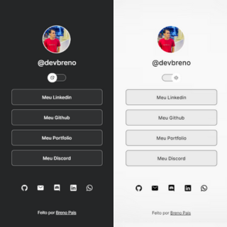

<h1 align="center"> Pagina de links </h1>

A Pagina de links para facilitar o acesso as redes profissionais.

  <a href="#-tecnologias">Tecnologias</a>&nbsp;&nbsp;&nbsp;-&nbsp;&nbsp;&nbsp;
  <a href="#-projeto">Projeto</a>&nbsp;&nbsp;&nbsp;&nbsp;&nbsp;&nbsp;

 

  

## 🚀 Tecnologias

Esse projeto foi desenvolvido com as seguintes tecnologias:

- HTML e CSS
- JavaScript
- Git e Github

## 💻 Projeto

A Pagina de links para facilitar o acesso as redes profissionais.
